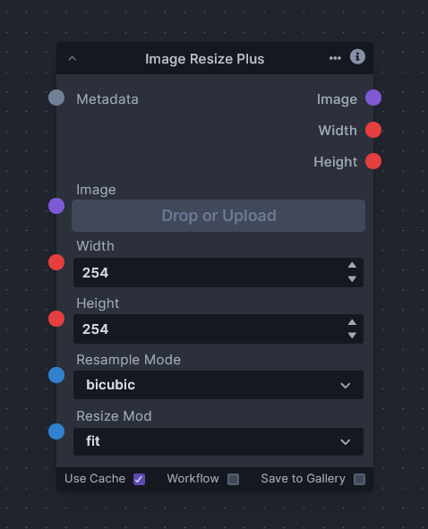

# Image Resize Plus

The "Image Resize Plus" node is an extension to the conventional "Image Resize" node, providing additional resizing options that give the user more control over the output dimensions and aspect ratio of the target image. This enhanced module introduces several modes to cater different resizing needs:

1. Fill: In this mode, the image is adjusted to completely fill the available space while maintaining its aspect ratio. This means the image may be cropped to fit the desired dimensions. The entire available space is covered, but some parts of the image may be cut off.

2. Stretch: In this mode, the image is forcibly stretched or squished to fit the specified dimensions, disregarding its original aspect ratio. This can lead to distortion of image as the aspect ratio is not maintained.

3. Fit: This mode ensures that the entire image fits within the specified dimensions, while maintaining its aspect ratio. The image is resized proportionally to fit entirely within the specified dimensions.

4. Center: In this mode, the image is centered within the specified dimensions without any scaling or cropping. If the original image is smaller than the specified dimensions, it will be displayed as is, with empty space around it.

5. Crop: This mode the image is not scaled to fit the specified dimensions. Instead, the original image is inserted into the available space while maintaining its original size. If the specified dimensions are smaller than the original image, part of the image will be cropped.
